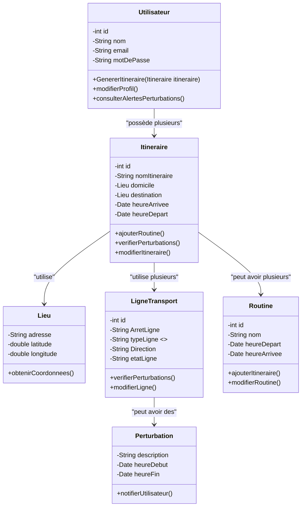

# Diagramme de NavXPert :

```mermaid


classDiagram
    class Utilisateur {
        -int id
        -String nom
        -String email
        -String motDePasse
        +GenererItineraire(Itineraire itineraire)
        +modifierProfil()
        +consulterAlertesPerturbations()
    }

    class Itineraire {
        -int id
        -String nomItineraire
        -Lieu domicile
        -Lieu destination
        -Date heureArrivee
        -Date heureDepart
        +ajouterRoutine()
        +verifierPerturbations()
        +modifierItineraire()
    }

    class Lieu {
        -String adresse
        -double latitude
        -double longitude
        +obtenirCoordonnees()
    }

    class LigneTransport {
        -int id
        -String ArretLigne
        -String typeLigne  <<Métro, RER, Bus, Tram>>
        -String Direction
        -String etatLigne
        +verifierPerturbations()
        +modifierLigne()
    }

    class Perturbation {
        -String description
        -Date heureDebut
        -Date heureFin
        +notifierUtilisateur()
    }

    class Routine {
        -int id
        -String nom
        -Date heureDepart
        -Date heureArrivee
        +ajouterItineraire()
        +modifierRoutine()
    }

    Utilisateur --> Itineraire : "possède plusieurs"
    Itineraire --> Routine : "peut avoir plusieurs"
    Itineraire --> Lieu : "utilise"
    Itineraire --> LigneTransport : "utilise plusieurs"
    LigneTransport --> Perturbation : "peut avoir des"
```
